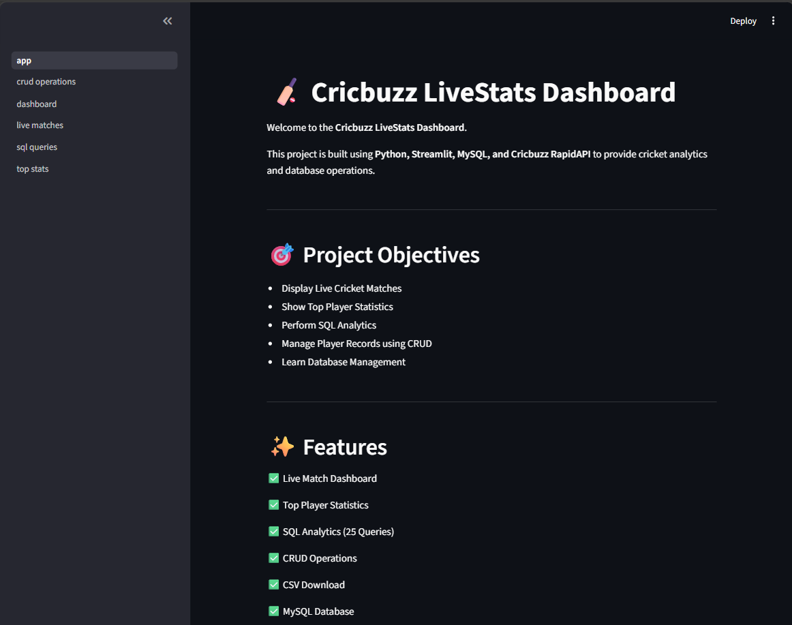
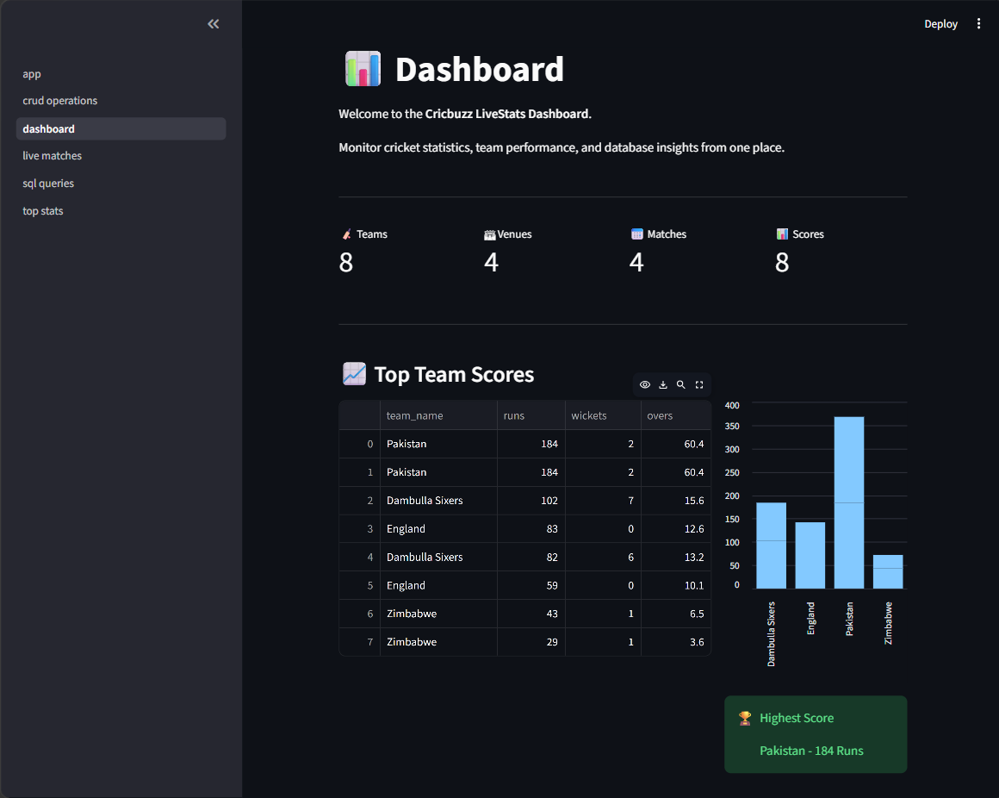
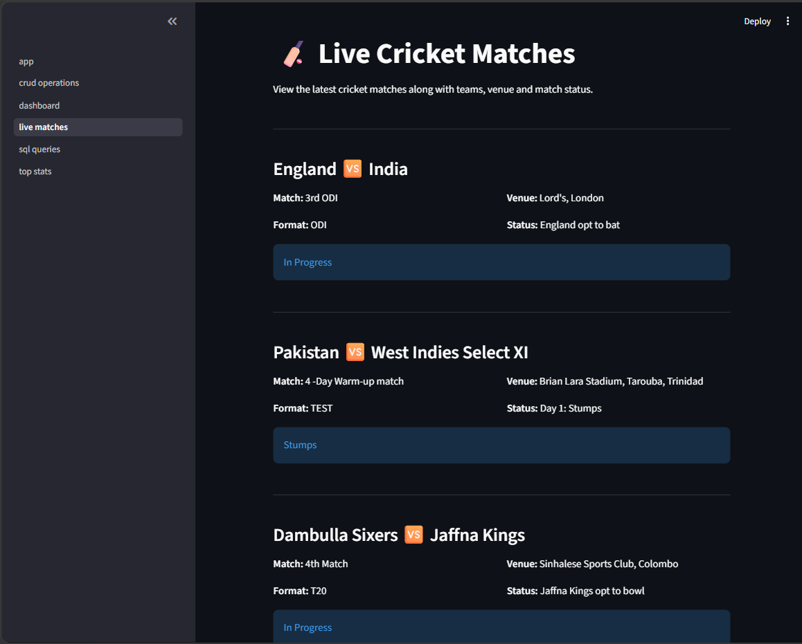
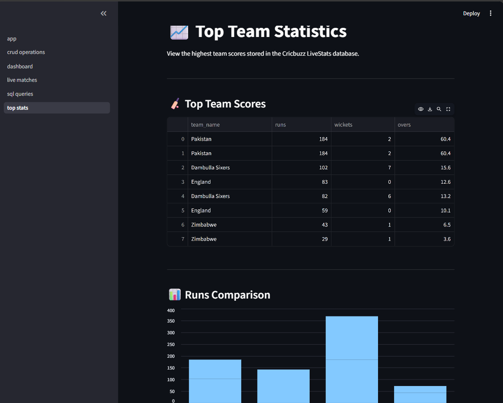
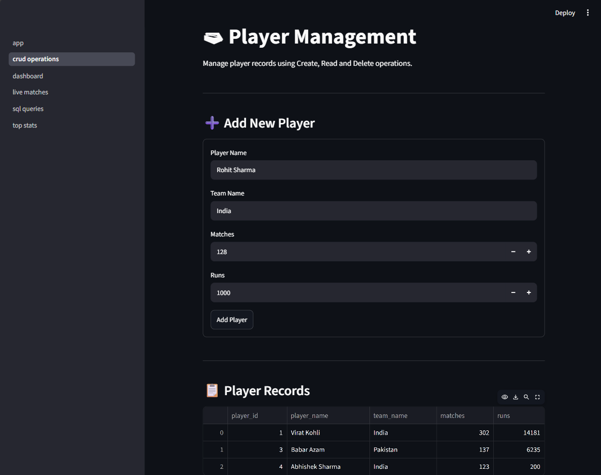
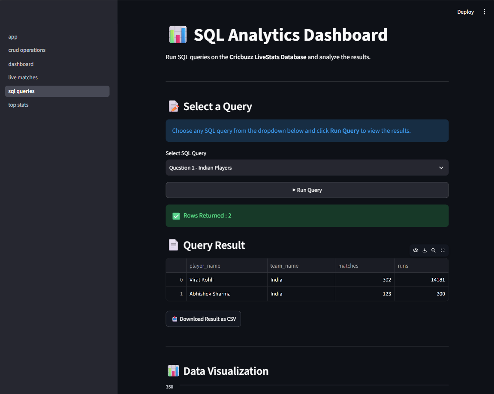

<div align="center">

# 🏏 Cricbuzz LiveStats Dashboard

### Live Cricket Analytics Platform powered by Python, Streamlit & MySQL

**📊 Track Live Matches • Analyze Team Statistics • Execute SQL Analytics • Manage Player Records**

<br>


<br><br>


</div>

---

<div align="center">

## 🚀 Bringing Live Cricket Data & SQL Analytics Together

**Live Match Tracking → Team Statistics → Player Management → SQL Analytics → Interactive Visualizations**

</div>

---

<p align="center">


</p>

<p align="center">
A modern cricket analytics platform that combines live match data, SQL analytics, player management, and interactive dashboards in one place.
</p>

</div>

---

# 📑 Table of Contents

- 📖 Project Overview
- ✨ Features
- 🛠 Tech Stack
- 🏗 Project Architecture
- 🗄 Database Schema
- 📸 Screenshots
- ⚙ Installation
- 📊 SQL Analytics
- 📂 Project Structure
- 🚀 Future Enhancements
- 👩‍💻 Author

---

# 📖 Project Overview

**Cricbuzz LiveStats Dashboard** is a data-driven cricket analytics application built with **Python, Streamlit, MySQL, and Cricbuzz RapidAPI**.

The dashboard fetches cricket data, stores it in a relational database, and presents it through an interactive web interface. It also includes SQL-based analytics, player management, and visual insights, making it suitable for learning database systems, API integration, and dashboard development.

---

# ✨ Features

| Feature               | Description                               |
| --------------------- | ----------------------------------------- |
| 🏠 Home Page          | Project overview and navigation           |
| 📊 Dashboard          | KPI cards with charts and statistics      |
| 🏏 Live Matches       | View live match details from Cricbuzz API |
| 📈 Top Statistics     | Team score analysis with visualizations   |
| 🗃 CRUD Operations    | Add, view, and delete player records      |
| 📋 SQL Analytics      | Execute 25 analytical SQL queries         |
| 📊 Data Visualization | Interactive charts and graphs             |
| 📥 CSV Export         | Download SQL query results                |

---

# 🛠 Tech Stack

| Category             | Technology        |
| -------------------- | ----------------- |
| Programming Language | Python            |
| Frontend             | Streamlit         |
| Database             | MySQL             |
| Data Analysis        | Pandas            |
| API                  | Cricbuzz RapidAPI |
| Visualization        | Streamlit Charts  |
| SQL                  | MySQL             |

---

# 🏗 Project Architecture

```text
          Cricbuzz API
                │
                ▼
        Python Service Layer
                │
                ▼
         MySQL Database
                │
                ▼
      Streamlit Dashboard UI
```

---

# 🗄 Database Schema

The project uses a normalized relational database consisting of the following tables:

- 🏏 Teams
- 👤 Players
- 🏟 Venues
- 📅 Matches
- 📊 Match Scores
- 🏆 Match Results
- 🎯 Player Batting Statistics
- 🎳 Player Bowling Statistics
- 🧤 Player Fielding Statistics
- 🤝 Partnerships
- 🥇 Series
- 🪙 Toss Details
- 📝 Innings

---

# 📸 Application Screenshots

## 🏠 Home



---

## 📊 Dashboard



---

## 🏏 Live Matches



---

## 📈 Top Statistics



---

## 🗃 CRUD Operations



---

## 📋 SQL Analytics



---

# 📊 SQL Analytics

The dashboard includes **25 analytical SQL queries**, such as:

- ✅ Indian Players
- ✅ Team Wins
- ✅ Top ODI Run Scorers
- ✅ Match Results
- ✅ Bowling Performance
- ✅ Fielding Statistics
- ✅ Toss Analysis
- ✅ Partnerships
- ✅ Player Rankings
- ✅ Career Summary
- ✅ Recent Batting Form

---

# 📂 Project Structure

```text
cricbuzz_livestats/
│── app.py
│── requirements.txt
│── README.md
│
├── pages/
│   ├── home.py
│   ├── dashboard.py
│   ├── live_matches.py
│   ├── top_stats.py
│   ├── crud_operations.py
│   └── sql_queries.py
│
├── services/
│
├── database/
│
├── assets/
│
└── notebooks/
```

---

# ⚙ Installation

```bash
git clone https://github.com/your-username/cricbuzz-livestats.git

cd cricbuzz-livestats

pip install -r requirements.txt

streamlit run app.py
```

---

# 🚀 Future Enhancements

- 🔐 User Authentication
- 🌙 Dark Mode
- 📱 Mobile Responsive UI
- 📊 Advanced Interactive Charts
- 🤖 AI-based Match Prediction
- 👥 Player Comparison Dashboard
- 📄 PDF Report Generation

---

# 👩‍💻 Author

**Ritika Tripathi**

🎓 B.Tech – Computer Science Engineering  
🏫 Allenhouse Institute of Technology, Kanpur

---

<div align="center">

### ⭐ If you found this project useful, don't forget to star the repository!

**Made with ❤️ using Python, Streamlit & MySQL**

</div>
